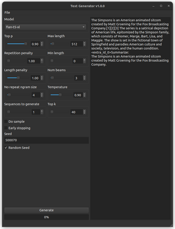

[](https://capsizegames.itch.io/chat-ai)
[](https://github.com/Capsize-Games/chatai/actions/workflows/python-publish.yml)
[](https://discord.gg/PUVDDCJ7gz)


# Chat AI: Run LLMs with your own hardware

Chat AI is an interface that sits on top of a custom engine which is responsible for processing requests and responses 
to and from an active Google T5-Flan model.



---

## Bundled Installation

[Official Build can be acquired here](https://capsizegames.itch.io/chat-ai) for those who want to use a compiled version of Chat AI without having to install any additional requirements

---

## Development

### Prerequisites

- Ubuntu 20.04+ or Windows 10+
- Python 3.10.6
- pip-23.0.1

---

### Docker

[Current builds of AI Runner are compiled with pyinstaller on docker.](https://github.com/Capsize-Games/airunner/pkgs/container/airunner%2Fairunner)

**Pull Docker container from repo**

Linux
```
docker pull ghcr.io/capsize-games/chatai/chatai:linux
```

Windows
```
docker pull ghcr.io/capsize-games/chatai/chatai:windows
```

**Build Docker**

Linux
```
docker-compose -f docker-compose.yml build
docker tag ghcr.io/capsize-games/chatai/chatai:linux ghcr.io/capsize-games/chatai/chatai:linux
docker push ghcr.io/capsize-games/chatai/chatai:linux
```

Windows
```
docker-compose -f docker-compose.windows.yml build
docker tag ghcr.io/capsize-games/chatai/chatai:linux ghcr.io/capsize-games/chatai/chatai:windows
docker push ghcr.io/capsize-games/chatai/chatai:windows
```

**Run the app using Docker**
```
docker-compose run linux python3 /app/main.py
```

**Build latest version** of AI Runner using Docker locally - this will output a `build` and `dist` folder on your machine.
```
docker run --rm -v $(pwd)/dist:/app/dist -v $(pwd)/build:/app/build ghcr.io/capsize-games/chatai/chatai:linux bash build.sh

docker run --rm -m 24g --cpus=12 -v $(pwd)/dist:/app/dist -v $(pwd)/build:/app/build ghcr.io/capsize-games/chatai/chatai:windows bash build.windows.sh
```

```
docker tag ghcr.io/capsize-games/chatai/chatai:linux ghcr.io/capsize-games/chatai/chatai:windows
docker push ghcr.io/capsize-games/chatai/chatai:windows
``

---

#### Pypi installation

Use this installation method if you intend to use Chat AI from the command line or with
other python libraries or scripts.

Windows
```
pip install torch==1.13.1 torchvision==0.14.1 torchaudio==0.13.1 --index-url https://download.pytorch.org/whl/cu117
pip install aihandlerwindows
pip install https://github.com/w4ffl35/diffusers/archive/refs/tags/v0.14.0.ckpt_fix_0.0.1.tar.gz
pip install https://github.com/w4ffl35/transformers/archive/refs/tags/tensor_fix-v1.0.2.tar.gz
pip install https://github.com/acpopescu/bitsandbytes/releases/download/v0.37.2-win.0/bitsandbytes-0.37.2-py3-none-any.whl
pip install chatai --no-deps
```

Linux
```
pip install https://github.com/w4ffl35/diffusers/archive/refs/tags/v0.14.0.ckpt_fix_0.0.1.tar.gz
pip install https://github.com/w4ffl35/transformers/archive/refs/tags/tensor_fix-v1.0.2.tar.gz
pip install chatairunner
```

#### Development installation

Use this installation method if you intend to modify the source code of Chat AI.

- Ubuntu 20.04+ or Windows 10+
- Python 3.10.6
- pip-23.0.1

1. Fork this repo on github
2. `git clone https://github.com/Capsize-Games/chatai`
3. `python -m venv env` - skip if you don't want to use venv
3. `cd chatai && pip install -e .`
4. `cd chatai && python main.py`

---

Here are the special tokens used by the model:

- <pad>: Used to pad sequences to a fixed length.
- <bos>: Beginning of sequence token, used to indicate the start of a sequence.
- <eos>: End of sequence token, used to indicate the end of a sequence.
- <unk>: Unknown token, used to represent out-of-vocabulary words.
- <mask>: Mask token, used for masked language modeling tasks.
- <extra_id_X>: Special token used to represent additional task-specific labels, where X is a number from 0 to 99.
- <eot>: End of turn token, used in conversation models to indicate the end of a speaker's turn.